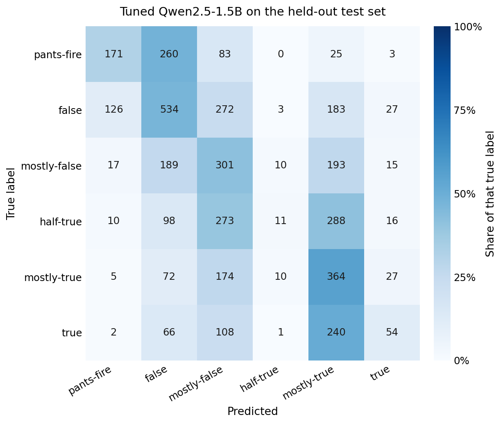
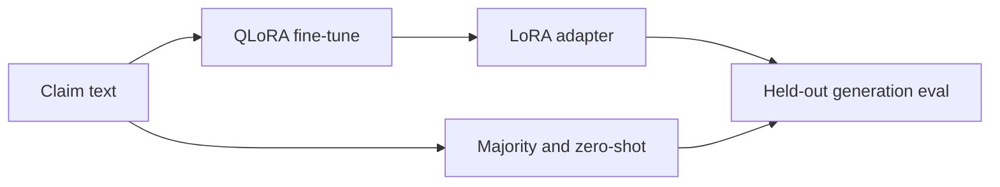

# Claim-only fact checking with Qwen2.5

Can a small language model recover PolitiFact's 6-way truthfulness rating from the claim text alone?

PolitiFact labels form an ordinal scale:

`pants-fire` < `false` < `mostly-false` < `half-true` < `mostly-true` < `true`

This repo fine-tunes Qwen2.5-0.5B and Qwen2.5-1.5B with 4-bit QLoRA on the claim. The model does not see the fact-check article or the sources a rater used. Fine-tuning teaches the scale but growing the model from 0.5B to 1.5B did not show improvement.

Machine-readable numbers, confusion counts, and the training-loss curve are in `[results/summary.json](results/summary.json)`.

---


## Result

Held-out test: 4,231 statements in `data/test.json`. MAE and within-1 use the label order above, so a neighbor error is smaller than a distant one. Quadratic weighted kappa (QWK) is 1 for perfect ordinal agreement and 0 for chance agreement.


| System                          | Accuracy | Macro-F1 | MAE   | Within 1 | QWK   |
| ------------------------------- | -------- | -------- | ----- | -------- | ----- |
| Majority class (`false`)        | 0.271    | —        | 1.536 | 0.570    | —     |
| Zero-shot Qwen2.5-0.5B          | 0.203    | 0.092    | 1.582 | 0.569    | 0.051 |
| QLoRA Qwen2.5-0.5B (fine-tuned) | 0.323    | 0.261    | 1.098 | 0.732    | 0.487 |
| QLoRA Qwen2.5-1.5B (fine-tuned) | 0.339    | 0.289    | 1.074 | 0.740    | 0.500 |


Zero-shot coverage is 0.764. On that row, macro-F1, MAE, within-1, and QWK use recognized labels only. Accuracy counts an unrecognized generation as wrong. Both tuned models produced a parseable label on every test row. On the 1.5B run, training loss falls from 1.33 at step 100 to 0.67 at step 900 and then plateaus, indicating that optimization converged. 

---


## Qwen2.5-1.5B model troubleshooting

Tuned Qwen2.5-1.5B on the test set. Rows are true labels, columns are predictions. The number in each cell is the count. The color is that count divided by the true-label row, so a darker cell is where most of that true class went. The same counts are in `[results/summary.json](results/summary.json)`.



Of 696 claims with true label `half-true`, the model predicts `half-true` only 11 times. 561 of them (81%) land on `mostly-false` or `mostly-true`. Across the whole test set the model emits `half-true` 35 times, even though `half-true` is common in training (2,901 of 16,921 train rows). It is possible that this middle of the scale is treated as a boundary between the two "mostly" labels and the model is unable to learn it. 

By design, an invalid string shows up as a parse failure instead of being forced into a class and are dropped before calculating `eval_macro_f1` (computed from the validation split). Hence, logged `eval_macro_f1` is 0.672 and unweighted Cohen's kappa is 0.608. Both of which are computed only on the 49% of validation strings that exactly equal a label. Therefore, 0.672 is not comparable to held-out accuracy or to the held-out macro-F1 of 0.289.

Beyond accuracy, it can be seen that 61% of the 1.5B model's mistakes are off by one step. MAE moves from 1.536 to 1.074 before and after tuning, and within-1 accuracy from 0.570 to 0.740.

---


## Setup


| Item               | Value                                                                                                           |
| ------------------ | --------------------------------------------------------------------------------------------------------------- |
| Train / test       | 16,921 / 4,231 statements                                                                                       |
| Validation         | 15% of `data/train.json`, seed 7 (2,539 rows). The test file is scored after training.                          |
| Train label counts | `false` 4,480, `half-true` 2,901, `mostly-false` 2,707, `mostly-true` 2,680, `pants-fire` 2,161, `true` 1,992   |
| Models             | Qwen2.5-1.5B (`configs/base.yaml`); Qwen2.5-0.5B for the matched pair and for smoke tests (`configs/test.yaml`) |
| QLoRA              | r=8, α=16, dropout=0.05; 4-bit NF4; attention and MLP projections                                               |
| Objective          | Causal LM loss on the label tokens. Prompt tokens are masked (`-100`). Exact label matches only.                |
| Schedule           | 2 epochs, lr 2e-4, cosine decay, warmup 0.1, batch 2 × grad accum 16, max length 256                            |
| Test decoding      | Greedy, 5 new tokens. The score is the longest label that prefixes the first line.                              |


The training prompt lives in the YAML config: one label from the six names, then the statement, then "answer with only the label." 




---


## Potential next steps

- Train a classification head, or an encoder classifier, on the same splits.
- Constrained decoding to the six labels, which removes the trailing-text failure.
- An ordinal loss, or regression on the 6-point scale, aimed at the `half-true` collapse.
- Condition the model on the fact-check article or cited evidence. Claim-only input is the ceiling this experiment measures.

---


## Reproduce

**Prereqs:** Python 3.11, CUDA 12.x, and an NVIDIA GPU for training.

```bash
uv sync

# Zero-shot baseline on the demo split
uv run src/zero_shot_eval.py --config configs/test.yaml

# Full QLoRA run (Qwen2.5-1.5B, data/train.json)
uv run src/finetune.py --config configs/base.yaml
```

```bash
make train_local   # QLoRA with configs/base.yaml
make test_local    # held-out eval of the tuned adapter
make test_base     # held-out zero-shot baseline, same config
make demo_model    # short fine-tune with configs/test.yaml
make demo_base     # zero-shot with configs/test.yaml
```

Adapters are written to `results/ar-qwen/` (gitignored). `make test_base` and `make test_local` compare the base model with the adapter.

### Data

JSONL, one record per line. Fields include `statement`, `verdict`, `statement_originator`, `statement_source`, `statement_date`, and `factcheck_analysis_link`.


| File                                             | Role                                    |
| ------------------------------------------------ | --------------------------------------- |
| `data/train.json` / `data/test.json`             | Full splits used by `configs/base.yaml` |
| `data/small_train.json` / `data/micro_test.json` | Tiny splits for smoke tests             |


Source: [Politifact Fact Check Dataset on Kaggle](https://www.kaggle.com/datasets/rmisra/politifact-fact-check-dataset). Ratings and article text belong to PolitiFact. This repo redistributes a postprocessed JSONL subset so the experiment can be rerun. The code license does not cover that data.

### MLflow

Local training logs to `sqlite:///mlflow.db`:

```bash
make show_mlflow
```

`make mlflow_ui` in Docker mounts `mlruns/`. A run that logged only to `mlflow.db` will look empty there. Use the sqlite UI for local runs from this config.

### Docker and AWS

`make build`, `make train`, and `make eval` run the same scripts in an NVIDIA CUDA 12.9 image. Optional EC2 / ECR targets live in the `Makefile` (`aws_spot`, `ecr_login`, `build_and_push`). Account ids and launch specs stay in local, gitignored files (`.env`, `spot-spec.json`, `ondemand-spec.json`).

### Layout

- `configs/` — `base.yaml` (1.5B, full data) and `test.yaml` (0.5B, tiny data)
- `data/` — postprocessed PolitiFact JSONL
- `src/finetune.py` — QLoRA training and MLflow logging
- `src/zero_shot_eval.py` — base and tuned generation eval
- `results/summary.json` — metrics for this report
- `Dockerfile`, `Makefile`, `pyproject.toml`

