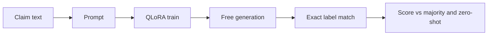

# Qwen2.5 Fact-Checking Classifier (PolitiFact)

Can a small local causal model learn PolitiFact's 6-way truthfulness scale from the claim text alone?

Held-out accuracy on the tuned Qwen2.5-1.5B run is 0.339. That sits above the majority-class baseline (0.271) but is not a useful fact-checker.

The task is a hard probe for three reasons:

- The labels are ordinal, and the distance between neighboring ratings is not a known number.
- The training file is imbalanced: `false` 4,480, `half-true` 2,901, `mostly-false` 2,707, `mostly-true` 2,680, `pants-fire` 2,161, `true` 1,992.
- The model sees the claim only, without the article or citations a PolitiFact rater used.

## Project overview

The goal is to classify a political statement as `pants-fire`, `false`, `mostly-false`, `half-true`, `mostly-true`, or `true`.

The main model is Qwen2.5-1.5B, adapted with 4-bit QLoRA. The stack is Python 3.11, PyTorch, Transformers, PEFT, and MLflow. 

The data is the [PolitiFact Fact Check Dataset (Kaggle / Rishabh Misra)](https://www.kaggle.com/datasets/rmisra/politifact-fact-check-dataset). The held-out files contain 16,921 train statements and 4,231 test statements. `finetune.py` then splits the train file 85% / 15% into train and validation with seed 7.



## Method

### Generative labels

I kept the language-model head and trained the model to generate one of the six verdict strings. Loss is applied only to those verdict tokens; prompt tokens are masked with -100. An invalid string shows up as a parse failure instead of being forced into a class. 

### QLoRA

The frozen base is loaded in 4-bit NormalFloat4 (NF4) with double quantization. LoRA without quantization would have kept the base weights in 16-bit. Full fine-tuning would have trained every weight. The 1.5B run took about 2.3 hours (`train_runtime` ≈ 8193 s).

### Training configuration

Numbers below are from one reported run per system. 

| Item | Value |
| --- | --- |
| Train / test | 16,921 / 4,231 statements |
| Split inside `finetune.py` | 85% train / 15% validation (seed 7) |
| Labels | 6-way ordinal truthfulness |
| Class counts (train file) | `false` 4,480; `half-true` 2,901; `mostly-false` 2,707; `mostly-true` 2,680; `pants-fire` 2,161; `true` 1,992 |
| QLoRA | r=8, α=16, dropout=0.05; 4-bit NF4 |
| Schedule | 2 epochs, lr 2e-4 cosine, batch 2 × grad accum 16 (effective batch 32) |
| Max length | 256 |

### How a prediction is scored

Held-out accuracy is free generation in `src/zero_shot_eval.py`. That script does not read the training prompt. `predict_label` uses its own hardcoded prompt: the same six labels, worded "one label only, chosen from" rather than the training template's "one label only from". It decodes at most 5 new tokens, strips whitespace and surrounding punctuation, and accepts the string only when that whole string is one of the six labels. Anything else is unrecognized and counts as a miss in overall accuracy.

After training, `finetune.py` calls `trainer.evaluate()` once on the validation split. That path is teacher-forced: it decodes the label-token span and compares the full string. On the tuned 1.5B run, `recognized_ratio` was about 0.49, and `eval_macro_f1` was about 0.67 on that recognized subset only. That 0.67 is not comparable to held-out accuracy or to the held-out macro-F1 of 0.289.

`zero_shot_eval.py` also computes ordinal mean absolute error and quadratic weighted kappa on recognized rows. Those figures were not saved, so they are not in the table below.

## Results

Held-out test unless a row says otherwise. Accuracy is exact label match, so a one-step miss counts the same as `pants-fire` versus `true`. The majority-class baseline is the test-set mode (`false`, 1,145 / 4,231).

| System | Accuracy | Notes |
| --- | --- | --- |
| Majority class (`false`) | 0.271 | Baseline for this imbalance. Not a generative system. |
| Zero-shot Qwen2.5-0.5B | 0.205 | Many malformed generations. |
| Tuned Qwen2.5-0.5B QLoRA | 0.323 | Above the 0.5B zero-shot run and the majority class. |
| Tuned Qwen2.5-1.5B QLoRA | 0.339 | Primary held-out run. Macro-F1 0.289. |
| Same 1.5B run, validation | 0.338 | Teacher-forced decode after training, not the held-out generation metric. |

The tuned 1.5B model was not scored zero-shot. The 0.205 row is Qwen2.5-0.5B, so the gap from 0.205 to 0.339 mixes model scale with fine-tuning.

### Findings

1. Fine-tuning raises accuracy over the 0.5B zero-shot run (0.205) and over the majority class (0.271). The tuned 1.5B result is still 0.339 on a 6-way task.
2. On the tuned 1.5B test set, `half-true` was almost never predicted as itself. Those claims were mostly mapped to `mostly-true` or `mostly-false`. The per-class table for that observation was not saved.
3. Malformed generations make the train-time recognized-only F1 incomparable to held-out accuracy.

## Limitations and next steps

- Score the base Qwen2.5-1.5B zero-shot on the same test file, so scale and fine-tuning can be separated.
- Train a classification head, or an encoder classifier, on the same splits.
- Report the ordinal MAE and quadratic weighted kappa that `zero_shot_eval.py` already computes.
- Constrain decoding to the six label strings.
- Repeat the run with more than one seed.

## Reproducibility

Prerequisites: Python 3.11, and CUDA 12.x with an NVIDIA GPU for training. Dependencies come from [pyproject.toml](pyproject.toml) and [uv.lock](uv.lock).

Smoke test on the tiny splits (Qwen2.5-0.5B):

```bash
uv sync
uv run src/finetune.py --config configs/test.yaml
uv run src/zero_shot_eval.py --config configs/test.yaml --model tuned
```

Full 1.5B run and held-out eval.

```bash
uv run src/finetune.py --config configs/base.yaml
uv run src/zero_shot_eval.py --config configs/base.yaml --model tuned
```

Each JSONL row includes `statement`, `verdict`, `statement_originator`, `statement_source`, `statement_date`, and `factcheck_analysis_link`.

| File | Role |
| --- | --- |
| `data/train.json`, `data/test.json` | Full splits for `configs/base.yaml` |
| `data/small_train.json`, `data/micro_test.json` | Tiny splits for the smoke test |

Source: [PolitiFact Fact Check Dataset on Kaggle](https://www.kaggle.com/datasets/rmisra/politifact-fact-check-dataset). Original ratings and article text belong to PolitiFact. This repo redistributes a postprocessed JSONL subset so the experiment can be reproduced. MIT license does not cover the data. 
